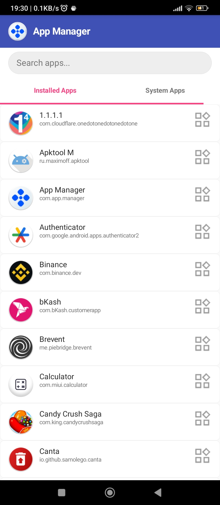

# App Manager – v8.7

  
*A lightweight and powerful Android app to manage both system and user-installed apps.*  

---

## Features  

- 🔍 **List All Apps**  
  - View all **installed apps**.  
  - Explore hidden and **system apps**.  

- 🗑️ **Uninstall Apps**  
  - Easily remove unwanted **user apps**.  
  - Manage **system apps** (with root).  

- ℹ️ **App Info Management**  
  - View **package name, version, size**.  
  - Open app settings directly.  
  - Extract APK for backup.  

- 🎨 **User-Friendly Interface**  
  - Lightweight, fast & optimized.  
  - Runs on **Android SDK 16+**.  

---

## Ui Preview - v8.7

  

---

## ⚙️ Permissions Required  

- `android.permission.QUERY_ALL_PACKAGES` – to list apps.  
- `android.permission.REQUEST_DELETE_PACKAGES` – to uninstall apps.  
- `android.permission.READ_EXTERNAL_STORAGE` – for APK extraction (optional).  

---

## Installation  

1. Download the latest APK from **[Releases](#)**.  
2. Install and grant necessary permissions.  
3. Start managing your apps with ease.  

---

## 🛠 Tech Stack  

- **Java** (No Kotlin used ✅)  
- **Android Support v4/v7 libraries**  
- **Native UI (no Material Design)**  

---

## Logo & Branding  

> Replace the placeholders with your own logo and screenshots in the `/assets/` folder:  
> - `logo.png` → App icon/logo  
> - `app_preview.png` → Screenshot of your UI  

---

## 📜 License  

This project is licensed under the **MIT License** – free to use and modify.  

---
